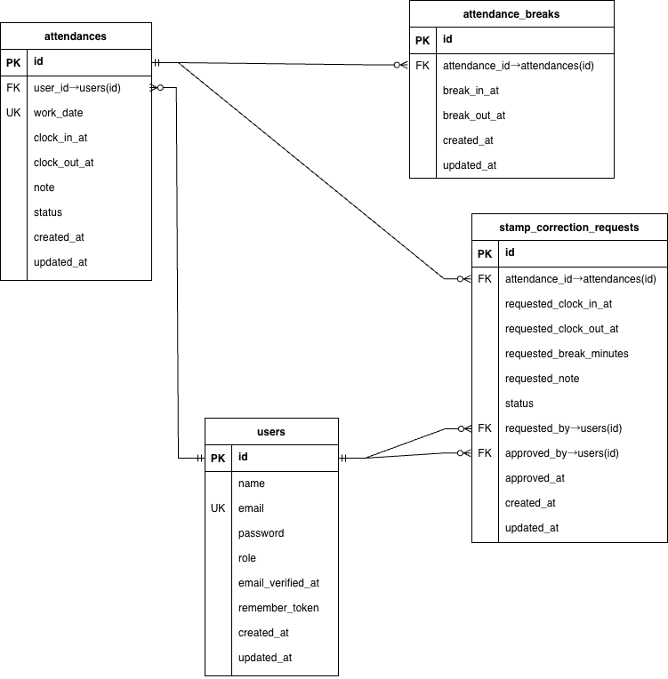

# COACHTECH 勤怠管理アプリ

一般ユーザーの勤怠打刻・勤怠履歴の確認、および管理者による勤怠情報の確認・修正申請の承認を行うことができる Web アプリケーションです。
ユーザーはログイン後に出勤・退勤・休憩の打刻や、日次／月次の勤怠情報の確認・修正申請ができます。
管理者ユーザーは、スタッフ一覧や日次・月次勤怠一覧、修正申請一覧から各レコードを確認し、勤怠の修正や承認／却下を行うことができます。

---

## アプリケーション概要

| 項目 | 内容 |
|------|------|
| サービス名 | **COACHTECH 勤怠管理アプリ** |
| 制作目的 | Laravel + Docker を用いた勤怠管理システムの開発 |
| 想定ユーザー | 一般社員 / 管理者ユーザー |
| 使用環境 | PC（Chrome / Firefox / Safari 最新版） |

---

## 主な機能

### 一般ユーザー向け

| 機能 | 内容 |
|------|------|
| ユーザー登録 / ログイン / ログアウト | Laravel Fortify 使用 |
| メール認証 | MailHog を使用して認証 |
| 勤怠打刻 | 出勤 / 退勤 / 休憩（複数回） |
| 勤怠一覧 | 月別の勤怠一覧表示 |
| 勤怠詳細・修正申請 | 日別詳細・修正申請登録 |
| 申請一覧 | 自分の申請状況（承認待ち / 承認済み）表示 |

### 管理者向け

| 機能 | 内容 |
|------|------|
| 管理者ログイン | Fortify認証 + `role = admin` 判定 |
| スタッフ一覧 | 氏名・メールアドレス一覧表示 |
| 日次勤怠一覧 | 指定日の全ユーザー勤怠 |
| 月次勤怠一覧 | ユーザー別履歴・CSV出力 |
| 勤怠詳細編集 | 出勤/退勤/休憩修正・備考 |
| 修正申請詳細 | 承認／却下処理 |

---

## ログイン情報

### 一般ユーザー

- 会員登録画面から任意のメールアドレス・パスワードで新規登録してください。
- 登録後、送信される認証メール（MailHog 経由）からメール認証を行うと、勤怠機能が利用可能になります。

### 管理者ユーザー

Seeder により以下の管理者ユーザーが作成されます。

| メールアドレス | パスワード |
|----------------|------------|
| `admin@example.com` | `Admin1234` |

> ※ 管理者ユーザーには `role = admin` が付与されており、管理画面（勤怠一覧・修正申請一覧など）にアクセスできます。

---

## 環境構築

### Dockerビルド
1. リポジトリのクローン
    ```bash
    git clone https://github.com/sametyan9999/laravel-attendance.git
    cd laravel-attendance
    ```

2. コンテナをビルド・起動
    ```bash
    docker compose up -d --build
    ```
※ MySQL が OS によって起動しない場合があるので、それぞれのPCに合わせて docker-compose.yml を編集してください。

### Laravel環境構築
1. PHPコンテナに入る
    ```bash
    docker compose exec php bash
    ```

2. 依存関係をインストール
    ```bash
    composer install
    ```

3. .env作成 & APP_KEY生成
    ```bash
    cp .env.example .env
    php artisan key:generate
    ```

4. `.env` の設定を修正
```
# =====================
# 基本設定
# =====================
APP_NAME=COACHTECH Attendance
APP_ENV=local
APP_KEY=
APP_DEBUG=true
APP_URL=http://localhost

LOG_CHANNEL=stack
LOG_LEVEL=debug

# =====================
# DB 設定（Docker 用）
# =====================
DB_CONNECTION=mysql
DB_HOST=mysql
DB_PORT=3306
DB_DATABASE=laravel_db
DB_USERNAME=laravel_user
DB_PASSWORD=laravel_pass

# =====================
# セッション / CSRF
# =====================
SESSION_DRIVER=file
SESSION_LIFETIME=120
SESSION_DOMAIN=localhost
SANCTUM_STATEFUL_DOMAINS=localhost

# =====================
# メール設定（MailHog）
# =====================
MAIL_MAILER=smtp
MAIL_HOST=mailhog
MAIL_PORT=1025
MAIL_USERNAME=null
MAIL_PASSWORD=null
MAIL_ENCRYPTION=null
MAIL_FROM_ADDRESS="no-reply@example.com"
MAIL_FROM_NAME="COACHTECH Attendance"

# =====================
# ファイルアップロード
# =====================
FILESYSTEM_DRIVER=public

```
※本プロジェクトでは Laravel 本体は `src/` ディレクトリ内に配置されています。
`.env` や `artisan` などの Laravel ルートファイルも `src/` に置かれます。

5. マイグレーション & シーディング
    ```bash
    php artisan migrate:fresh --seed
    ```

---

### Seeder 内容

| Seeder名 | 内容 | 実行タイミング |
|----------|------|-----------------------------|
| **AdminUserSeeder** | 管理者ユーザーを1件作成 | `DatabaseSeeder` から自動実行される |
| UsersTableSeeder | 画面確認用の一般ユーザーを作成 | 必要に応じて手動実行 |
| AttendancesTableSeeder | 画面確認用の勤怠データを作成 | 必要に応じて手動実行 |
| AttendanceBreaksTableSeeder | 画面確認用の休憩データを作成 | 必要に応じて手動実行 |
| StampCorrectionRequestsTableSeeder | 画面確認用の修正申請データを作成 | 必要に応じて手動実行 |

#### 手動実行例（必要な場合のみ）

```bash
# 一般ユーザーだけ流す
docker compose exec php php artisan db:seed --class=UsersTableSeeder

# 勤怠データと休憩データも合わせて流す
docker compose exec php php artisan db:seed --class=AttendancesTableSeeder
docker compose exec php php artisan db:seed --class=AttendanceBreaksTableSeeder

# 修正申請データも確認したい場合
docker compose exec php php artisan db:seed --class=StampCorrectionRequestsTableSeeder
```

---

## テスト実行方法
本プロジェクトでは PHPUnit による自動テストを用意しています。
```bash
docker compose exec php bash
php artisan test
```
env.testing は自動で読み込まれます
```
APP_ENV=testing
APP_DEBUG=true
DB_CONNECTION=sqlite
DB_DATABASE=:memory:
```

---

## ディレクトリ構成

本プロジェクトでは、Laravel 本体は `src/` ディレクトリ内に配置されています。
以下は `src` 配下の主なディレクトリ構成です。

```bash
src
├─ app
│  ├─ Actions
│  │   └─ Fortify          # Fortify 用のカスタムアクション
│  ├─ Http
│  │   ├─ Controllers      # 画面ごとのコントローラ（Front / Admin）
│  │   ├─ Middleware
│  │   ├─ Requests         # FormRequest（バリデーション）
│  │   └─ Responses
│  ├─ Models               # User / Attendance / Break / 申請などのモデル
│  ├─ Policies
│  │   └─ AttendancePolicy.php  # 勤怠閲覧のアクセス制御
│  └─ Providers            # 各種サービスプロバイダ
├─ bootstrap
├─ config                  # アプリ全体の設定（DB / Mail / Fortify など）
├─ database
│  ├─ factories            # テスト・シーディング用の Factory
│  ├─ migrations           # テーブル定義
│  └─ seeders              # 初期データ・ダミーデータ投入用
├─ public
│  ├─ css                  # ビルド済み CSS（画面別に分割）
│  ├─ images               # ロゴ画像など
│  └─ index.php            # エントリポイント
├─ resources
│  ├─ js                   # JS エントリ・bootstrap
│  ├─ lang                 # 日本語 / 英語の翻訳ファイル
│  └─ views
│     ├─ admin             # 管理者画面用 Blade
│     ├─ attendance        # 一般ユーザー勤怠画面用 Blade
│     ├─ auth              # 認証関連画面
│     ├─ components        # 共通コンポーネント（ヘッダーなど）
│     └─ layouts           # 共通レイアウト
├─ routes
│  └─ web.php              # Web ルーティング定義
├─ tests
│  ├─ Feature              # 機能テスト（勤怠 / 認証 / 管理者機能など）
│  └─ Unit                 # ユニットテスト
└─ vendor                  # Composer 依存パッケージ
```
---

## 使用技術(実行環境)
| 分類 | 使用技術 |
|------|-------------------------------|
| 言語 | PHP 8.1 |
| フレームワーク | Laravel 8.x |
| 認証 | Laravel Fortify / Laravel Sanctum |
| DB | MySQL 8.0.26 |
| フロント | Blade / jQuery 3.7 |
| インフラ | Docker / Docker Compose |
| 開発ツール | phpMyAdmin / MailHog |
| テスト | PHPUnit 9.5 |
| バージョン管理 | Git / GitHub |

## ER図


## アプリケーションURL
| ページ | URL |
|--------|------------------------------|
| ユーザー登録 | http://localhost/register |
| 一般ログイン | http://localhost/login |
| 管理者ログイン | http://localhost/admin/login |
| MailHog | http://localhost:8025 |
| phpMyAdmin | http://localhost:8080 |

---

© 2025 COACHTECH 勤怠管理アプリ